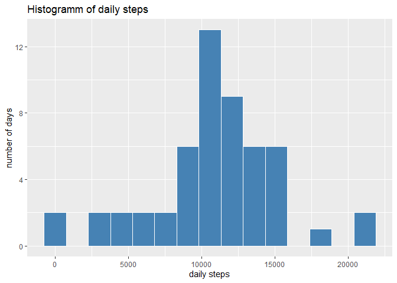
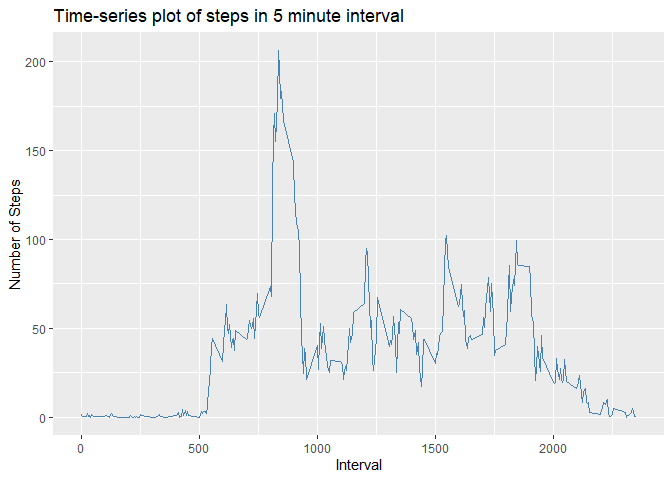
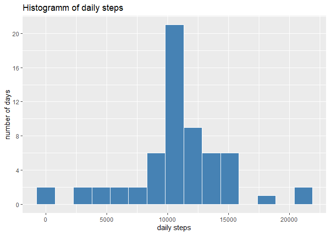
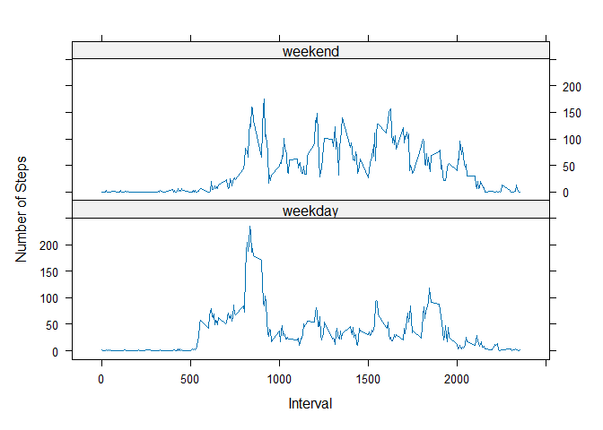

## Loading and preprocessing the data


``` r
# loading libraries
library(readr)
library(dplyr)
library(ggplot2)
library(xtable)
library(lattice)

# loading the data
df1 <- read_csv(unz("activity.zip","activity.csv"))
head(df1)
```

```
## # A tibble: 6 × 3
##   steps date       interval
##   <dbl> <date>        <dbl>
## 1    NA 2012-10-01        0
## 2    NA 2012-10-01        5
## 3    NA 2012-10-01       10
## 4    NA 2012-10-01       15
## 5    NA 2012-10-01       20
## 6    NA 2012-10-01       25
```

``` r
# creating a new data frame df2, which contains all the date containing NAs and summing the number of NAs
df2 <- df1 %>%
  group_by(date) %>%
  summarise(na_steps = sum(is.na(steps))
  ) %>% filter(na_steps > 0)

# adding a new column converting date and time into POSIX format
df3 <- df1 %>%
  mutate(
    time_str = sub("^(..)(..)$", "\\1:\\2", sprintf("%04d", as.integer(interval))),
    time_posix = as.POSIXct(
      paste(date, time_str),
      format = "%Y-%m-%d %H:%M",
      tz = "UTC"
    )
  )

# creating a new data frame df4, removing all the dates containing only NAs
df4 <- df3 %>% anti_join(df2 %>% select(date), by="date")
```


## What is mean total number of steps taken per day?


``` r
# Group the dataframe by date and sum up the steps per date
df_steps <- df4 %>% group_by(date) %>% summarise(daily_steps = sum(steps, na.rm = TRUE),.groups = "drop")

p1 <- ggplot(df_steps, aes(x = daily_steps)) + geom_histogram(bins=15, color = "white", fill="steelblue") + labs(x="daily steps", y ="number of days", title = "Histogramm of daily steps") + scale_y_continuous(breaks = c(0, 4, 8, 12))

# Calculate median and mean of daily steps (remember: for df4 all the days without data were removed, so the mean value is not distorted by NAs)
med_ds <- median(df_steps$daily_steps)
mean_ds <- round(mean(df_steps$daily_steps),1)
```

Based on the dates were activity was reported, the histogram for the daily steps is as follows:


``` r
p1
```

<!-- -->

The mean of daily steps is 10766.2 and the median of the daily steps is 10765, rounded to 1 digit.

## What is the average daily activity pattern?

The time series plot for the 5-minunte interval is as follows

``` r
# Calculate the mean steps for every interval
df5 <- df4 %>% group_by(interval) %>% summarize(mean_steps = round(mean(steps), digits=1))

p2 <- ggplot(df5, aes(x=interval, y = mean_steps)) + geom_line(col="steelblue") + labs(x="Interval", y ="Number of Steps", title = "Time-series plot of steps in 5 minute interval")
p2
```

<!-- -->

``` r
# Cut df5 to only the maximum value of steps

df6 <- df5 %>% slice_max(mean_steps, n=1, with_ties = FALSE)
```

The interval with the maximum number of steps averaged across all day is the 835 interval with an average of 206.2 steps.

## Imputing missing values


``` r
# Create a new dataframe where df1 and df6 (containing the mean steps per interval are combined) and add a new column new_steps containing the steps or if the original steps column is NA, take the value from the mean_steps column)
df3_complete <- df3 %>% left_join(df5, by="interval") %>% mutate(new_steps = coalesce(steps, mean_steps))

# Calculate the missing values
miss_val <- sum(is.na(df1$steps))

# Group df3_complete by date and summarize daily steps
df_steps_comp <- df3_complete %>% group_by(date) %>% summarise(daily_steps = sum(new_steps),.groups = "drop")

p3 <- ggplot(df_steps_comp, aes(x = daily_steps)) + geom_histogram(bins=15, color = "white", fill="steelblue") + labs(x="daily steps", y ="number of days", title = "Histogramm of daily steps") + scale_y_continuous(breaks = c(0, 4, 8, 12, 16, 20))

# Calculated median and average based on imputed data
med_ds_comp <- round(median(df_steps_comp$daily_steps),0)
mean_ds_comp <- round(mean(df_steps_comp$daily_steps),1)
```

The total missing values in the dataframe are 2304. To compensate for the missing value, the mean value has been calculated for every interval and inserted for the specific interval and day, whereever a value was missing.

The histogram of the daily steps after imputing missing values is as follows:


``` r
p3
```

<!-- -->

After imputing missing values the mean of daily steps is 10766.2 and the median of the daily steps is 10766 and therefore almost unchaged. This is due to the method used for imputing: for every interval the 
with NA the average value of steps for this interval calculated for all days where values were not missing, was used.

## Are there differences in activity patterns between weekdays and weekends?

``` r
# Create new dataframe where a column with Weekday types (weekday or weekend) is added
df4_days <- df4 %>% mutate(Weekday = weekdays(time_posix)) %>%
    mutate(Daytype = case_when(
        Weekday == "Monday" ~ "weekday",
        Weekday == "Tuesday" ~ "weekday",
        Weekday == "Wednesday" ~ "weekday",
        Weekday == "Thursday" ~ "weekday",
        Weekday == "Friday" ~ "weekday",
        Weekday == "Saturday" ~ "weekend",
        Weekday == "Sunday" ~ "weekend"
    ))

df4_days_summary <- df4_days %>% group_by(date, Daytype) %>% summarise(daily_steps = sum(steps),.groups = "drop")
df4_avg_steps <- df4_days_summary %>% group_by(Daytype) %>% summarise(avg_steps = mean(daily_steps),.groups = "drop")
```

The average daily steps for weekdays are 10177 and for weekends 12407.


``` r
df4_avg_int_steps <- df4_days %>% group_by(interval, Daytype) %>% summarise(avg_int_steps = mean(steps),.groups = "drop")

xyplot(avg_int_steps ~ interval | Daytype, data = df4_avg_int_steps, layout = c(1,2), type = "l",xlab = "Interval", ylab = "Number of Steps")
```

<!-- -->
Whereas the average steps per time interval are more homogeneously distributed on the weekend from morning to evening, there is a shareper peak during morning hours on weekdays and less activity during lunchtime and early afternoon.
